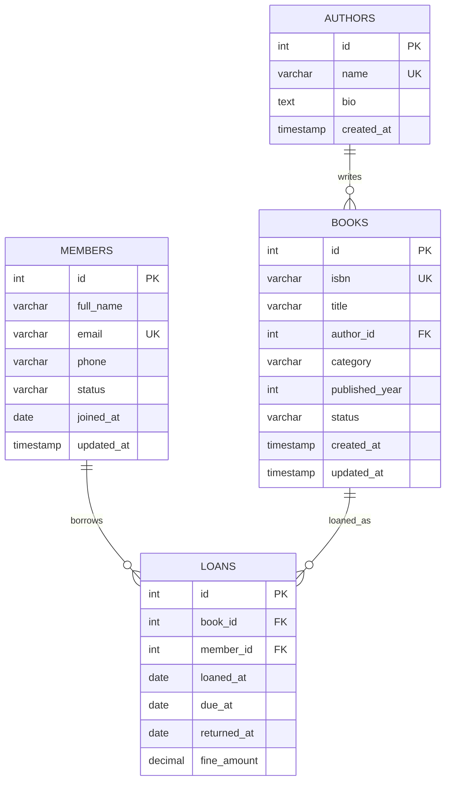

# ER Diagram

Image version: [er-diagram-relationship-summary.svg](er-diagram-relationship-summary.svg)

## Relationship Summary

| Relationship | Type | Description |
| --- | --- | --- |
| Authors to Books | One-to-many | One author can write many books. Each book has one author. |
| Members to Loans | One-to-many | One member can have many historical loans. Each loan belongs to one member. |
| Books to Loans | One-to-many | One book can appear in many historical loans. Only one active loan per book is allowed. |

## Cardinality Rules

- A book cannot exist without an author.
- A loan cannot exist without a valid book and valid member.
- A book can have many past loans, but only one loan where `returned_at IS NULL`.
- A member can borrow up to 3 active books.
